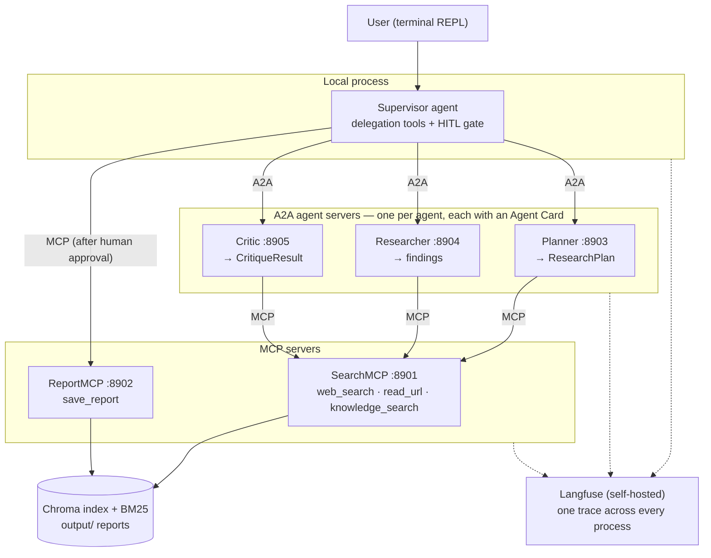
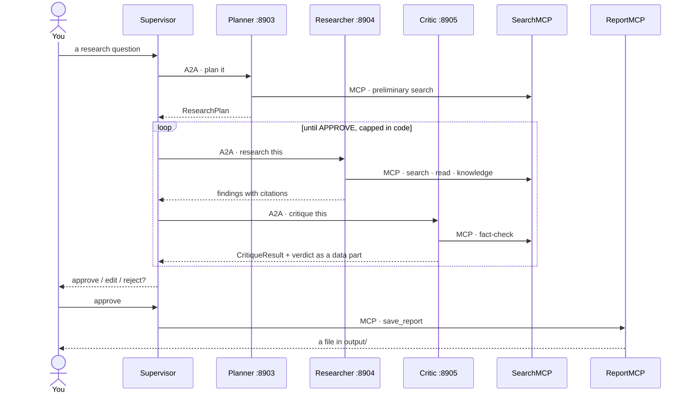

# MA_systems_hl10

A terminal multi-agent research system where every hop crosses a protocol.
You ask a research question; four agents plan, research and critique the
answer, and a report is saved only after you approve it. The agents talk to
their tools over **MCP** and to each other over **A2A** — each sub-agent is
its own A2A server with its own Agent Card, and the coordinator is the only
agent living in your terminal's process.

Built with LangChain/LangGraph, FastMCP, `a2a-sdk` and Langfuse. Extends
[MA_systems_hl8](https://github.com/felkost/MA_systems_hl8), which ran the
same Plan → Research → Critique loop in a single process; this project splits
it across six.

## Architecture



The Critic can send the Researcher back for another round with concrete
feedback; the loop is capped in code, not in a prompt. Nothing reaches disk
without an explicit `approve` at the terminal.

## The main scenario

One question, end to end. Every arrow between the Supervisor and an agent is an
A2A call to that agent's own server; every arrow from an agent to a tool
server is an MCP call.



## Install and run

You need Python 3.12, an API key for your model provider (OpenAI or
OpenRouter — chosen per agent in `.env`, see the comments in `.env.example`),
Docker for Langfuse, and about 3 GB of disk for the index and the reranking
model.

```bash
git clone <this repository>
cd MA_systems_hl10
python -m venv .venv
source .venv/Scripts/activate        # or your platform's equivalent
pip install -r requirements.txt -r requirements-dev.txt
cp .env.example .env                 # then fill in the keys
python ingest.py                     # build the search index (once)
python servers.py                    # start both MCP and all three A2A servers
python main.py                       # the REPL, in a second terminal
```

Or start each server yourself, as the assignment prescribes:

```bash
python mcp_servers/search_mcp.py     # port 8901
python mcp_servers/report_mcp.py     # port 8902
python a2a_servers.py                # ports 8903, 8904, 8905
python main.py
```

## Configuration: providers and models

Every model in this system — the four agents plus the evaluation judge — is
chosen **per role**, with a global fallback:

```
provider(role) = <ROLE>_PROVIDER   or LLM_PROVIDER
model(role)    = <ROLE>_MODEL_NAME or MODEL_NAME
```

`<ROLE>` is one of `SUPERVISOR`, `PLANNER`, `RESEARCHER`, `CRITIC`, `JUDGE`.

**The typical configuration is one line.** `LLM_PROVIDER` and `MODEL_NAME`
already default to `openai` and `gpt-4.1-mini` in `config.py`, so everything on
OpenAI needs only:

```ini
OPENAI_API_KEY=sk-...
```

Moving every role to OpenRouter is three lines:

```ini
LLM_PROVIDER=openrouter
MODEL_NAME=openai/gpt-4.1-mini
OPENROUTER_API_KEY=sk-or-v1-...
```

Giving one role a stronger model is one more, with nothing else touched:

```ini
CRITIC_MODEL_NAME=anthropic/claude-sonnet-4.5
```

Providers may be mixed per role. Each resolved role's key must be present:

```ini
LLM_PROVIDER=openai
CRITIC_PROVIDER=openrouter
CRITIC_MODEL_NAME=anthropic/claude-sonnet-4.5
OPENAI_API_KEY=sk-...
OPENROUTER_API_KEY=sk-or-v1-...
```

Two rules are checked when the configuration is loaded — offline, in every
process, before any request is sent:

- **Model ids must match their provider.** OpenRouter ids are always
  `vendor/slug`; OpenAI ids never contain a slash. A mismatched pair is refused
  at construction, naming the role — never sent to the wrong endpoint.
- **A role's key must exist.** A role resolving to a provider whose API key is
  absent fails the same way, naming the role and the missing variable. Which
  keys are *required* is decided by the roles you actually configured, which is
  why both key fields are optional.

**Embeddings are a separate setting, because OpenRouter has no embeddings
endpoint:**

```ini
EMBEDDING_PROVIDER=local            # openai | local
EMBEDDING_MODEL=BAAI/bge-m3         # a Hugging Face id when local
```

With `local` embeddings and OpenRouter chat, no OpenAI key is needed anywhere.
`index/manifest.json` records the embedding provider, model and dimensions that
built the index; an index built under a different fingerprint is refused rather
than answering from vectors of another embedding space — rebuild it with
`python ingest.py`.

## Cleanup

Stop the REPL and the servers with `Ctrl+C` — `servers.py` shuts its three
children down with it. Then, in order of how much you want gone:

```bash
docker compose down                  # stop Langfuse, keep its traces
docker compose down -v               # ...and delete them with the volumes
```

```bash
rm -rf index/                        # the search index; rebuild with python ingest.py
rm -rf logs/ runtime/                # rotating logs and the crash-recovery checkpoint
rm -rf .cache/                       # downloaded models and package caches
rm -rf .venv/                        # the environment itself
```

Everything above is rebuildable from the repository — nothing there is a
source of truth. The two directories to leave alone are `data/` (the documents
the index is built from) and `output/` (reports you approved).

## Progress

- [x] Stage 0 — kickoff: repository, standards, staged plan
- [x] Stage 1 — RAG foundation (`ingest.py`, `retriever.py`, manifest with content hashes)
- [x] Stage 2 — SearchMCP :8901 (3 tools + resource)
- [x] Stage 3 — ReportMCP :8902 (`save_report` + resource), plus the `read_url` egress guardrail
- [x] Stage 4 — the Planner's A2A server :8903 with its Agent Card
- [x] Stage 5 — Researcher :8904 + Critic :8905 over A2A, plus `middleware.py` and the output-shape guardrail
- [x] Stage 6 — Supervisor + REPL: Plan → Research → Critique over the protocols, `save_report` not yet bound
- [ ] Stage 7 — HITL on `save_report` + crash-safe checkpoint
- [ ] Stage 8 — launcher, preflight, auth token
- [ ] Stage 9 — Langfuse + OpenTelemetry: one question, one trace
- [ ] Stage 10 — evaluation: golden dataset, LLM judge, statistics
- [ ] Stage 11 — final report (EN/UA)

## Documentation

The full report — architecture, tested scenarios, measured numbers with
confidence intervals, and the cost of the protocol split against the hl8
baseline — ships at stage 11 as `report/report_en.md` and
`report/report_ua.md`.
