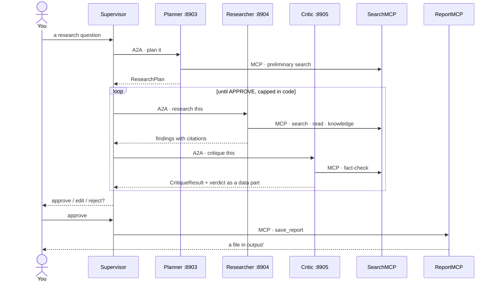

# MA_systems_hl10

A terminal multi-agent research system where every hop crosses a protocol.
You ask a research question; four agents plan, research and critique the
answer, and a report is saved only after you approve it. The agents talk to
their tools over **MCP** and to each other over **A2A** — each sub-agent is
its own A2A server with its own Agent Card, and the coordinator is the only
agent living in your terminal's process.

Built with LangChain/LangGraph, FastMCP, `a2a-sdk` and Langfuse. Extends
[MA_systems_hl8](https://github.com/felkost/MA_systems_hl8), which ran the
same Plan → Research → Critique loop in a single process; this project splits
it across six.

## Architecture


The Critic can send the Researcher back for another round with concrete
feedback; the loop is capped in code, not in a prompt. Nothing reaches disk
without an explicit `approve` at the terminal.

## The main scenario

One question, end to end. Every arrow between the Supervisor and an agent is an
A2A call to that agent's own server; every arrow from an agent to a tool
server is an MCP call.



## Install and run

You need Python 3.12, an API key for your model provider (OpenAI or
OpenRouter — chosen per agent in `.env`, see the comments in `.env.example`),
Docker for Langfuse, and about 3 GB of disk for the index and the reranking
model.

```bash
git clone <this repository>
cd MA_systems_hl10
python -m venv .venv
source .venv/Scripts/activate        # or your platform's equivalent
pip install -r requirements.txt -r requirements-dev.txt
cp .env.example .env                 # then fill in the keys
python ingest.py                     # build the search index (once)
python servers.py                    # start both MCP and all three A2A servers
python main.py                       # the REPL, in a second terminal
```

Or start each server yourself, as the assignment prescribes:

```bash
python mcp_servers/search_mcp.py     # port 8901
python mcp_servers/report_mcp.py     # port 8902
python a2a_servers.py                # ports 8903, 8904, 8905
python main.py
```

## Cleanup

Stop the REPL and the servers with `Ctrl+C` — `servers.py` shuts its three
children down with it. Then, in order of how much you want gone:

```bash
docker compose down                  # stop Langfuse, keep its traces
docker compose down -v               # ...and delete them with the volumes
```

```bash
rm -rf index/                        # the search index; rebuild with python ingest.py
rm -rf logs/ runtime/                # rotating logs and the crash-recovery checkpoint
rm -rf .cache/                       # downloaded models and package caches
rm -rf .venv/                        # the environment itself
```

Everything above is rebuildable from the repository — nothing there is a
source of truth. The two directories to leave alone are `data/` (the documents
the index is built from) and `output/` (reports you approved).

## Progress

- [x] Stage 0 — kickoff: repository, standards, staged plan
- [x] Stage 1 — RAG foundation (`ingest.py`, `retriever.py`, manifest with content hashes)
- [ ] Stage 2 — SearchMCP :8901 (3 tools + resource)
- [ ] Stage 3 — ReportMCP :8902 (`save_report` + resource)
- [ ] Stage 4 — the Planner's A2A server :8903
- [ ] Stage 5 — Researcher :8904 + Critic :8905 over A2A
- [ ] Stage 6 — Supervisor + REPL: the loop runs over the protocols
- [ ] Stage 7 — HITL on `save_report` + crash-safe checkpoint
- [ ] Stage 8 — launcher, preflight, auth token
- [ ] Stage 9 — Langfuse + OpenTelemetry: one question, one trace
- [ ] Stage 10 — evaluation: golden dataset, LLM judge, statistics
- [ ] Stage 11 — final report (EN/UA)

## Documentation

The full report — architecture, tested scenarios, measured numbers with
confidence intervals, and the cost of the protocol split against the hl8
baseline — ships at stage 11 as `report/report_en.md` and
`report/report_ua.md`.
