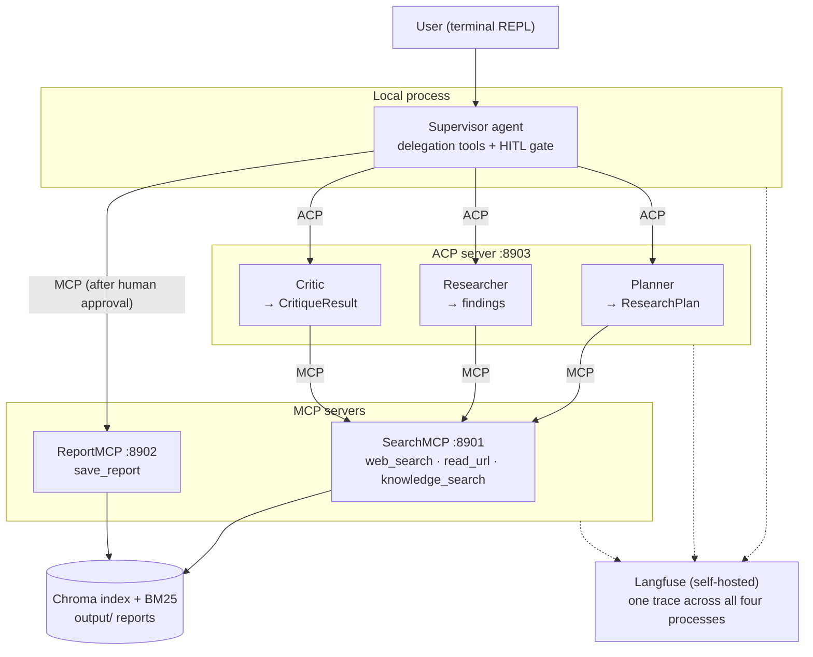

# MA_systems_hl9

A terminal multi-agent research system where every hop crosses a protocol.
You ask a research question; four agents plan, research and critique the
answer, and a report is saved only after you approve it. The agents talk to
their tools over **MCP** and to each other over **ACP** — the coordinator is
the only agent living in your terminal's process.

Built with LangChain/LangGraph, FastMCP, `acp-sdk` and Langfuse. Extends
[MA_systems_hl8](https://github.com/felkost/MA_systems_hl8), which ran the
same Plan → Research → Critique loop in a single process; this project splits
it across four.

## Architecture



The Critic can send the Researcher back for another round with concrete
feedback; the loop is capped in code, not in a prompt. Nothing reaches disk
without an explicit `approve` at the terminal.

## Install and run

You need Python 3.12, an OpenAI API key, Docker (for Langfuse) and about
3 GB of disk for the index and the reranking model.

```bash
git clone <this repository>
cd MA_systems_hl9
python -m venv .venv
source .venv/Scripts/activate        # or your platform's equivalent
pip install -r requirements.txt -r requirements-dev.txt
cp .env.example .env                 # then fill in the keys
python ingest.py                     # build the search index (once)
python servers.py                    # start SearchMCP, ReportMCP, ACP
python main.py                       # the REPL, in a second terminal
```

Or start each server yourself, as the assignment prescribes:

```bash
python mcp_servers/search_mcp.py     # port 8901
python mcp_servers/report_mcp.py     # port 8902
python acp_server.py                 # port 8903
python main.py
```

## Progress

- [x] Stage 0 — kickoff: repository, standards, staged plan
- [ ] Stage 1 — RAG foundation (`ingest.py`, `retriever.py`, manifest with content hashes)
- [ ] Stage 2 — SearchMCP :8901 (3 tools + resource)
- [ ] Stage 3 — ReportMCP :8902 (`save_report` + resource)
- [ ] Stage 4 — ACP server with the Planner
- [ ] Stage 5 — Researcher + Critic over ACP
- [ ] Stage 6 — Supervisor + REPL: the loop runs over the protocols
- [ ] Stage 7 — HITL on `save_report` + crash-safe checkpoint
- [ ] Stage 8 — launcher, preflight, auth token
- [ ] Stage 9 — Langfuse + OpenTelemetry: one question, one trace
- [ ] Stage 10 — evaluation: golden dataset, LLM judge, statistics
- [ ] Stage 11 — final report (EN/UA)

## Documentation

The full report — architecture, tested scenarios, measured numbers with
confidence intervals, and the cost of the protocol split against the hl8
baseline — ships at stage 11 as `report/report_en.md` and
`report/report_ua.md`.
