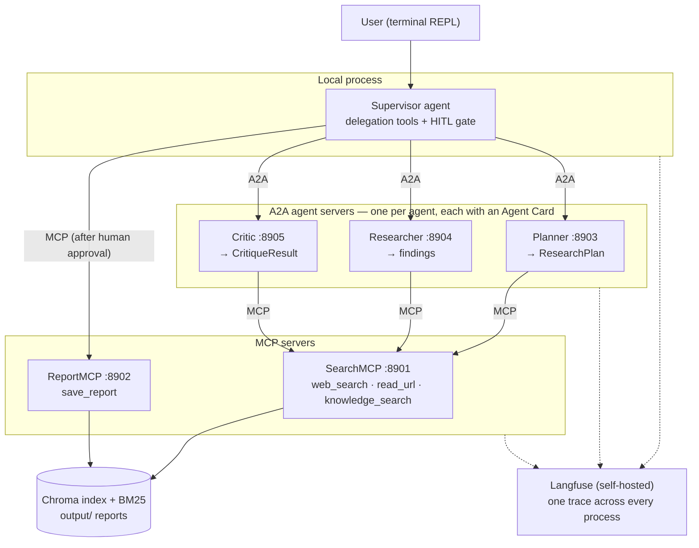
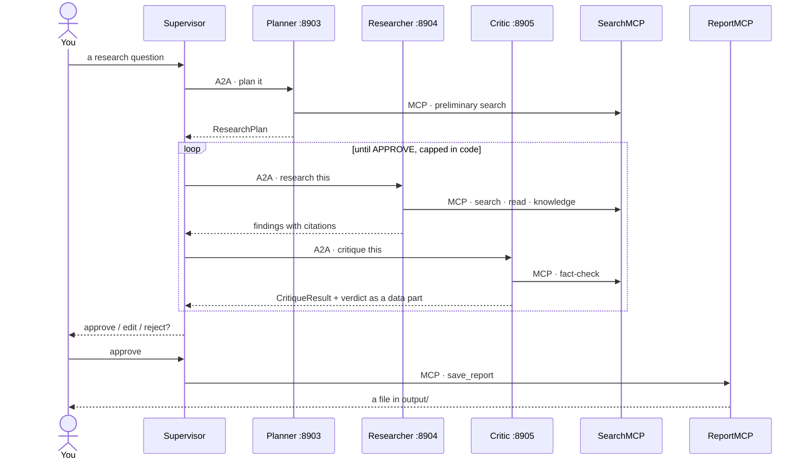

# MA_systems_hl10

A terminal multi-agent research system where every hop crosses a protocol.
You ask a research question; four agents plan, research and critique the
answer, and a report is saved only after you approve it. The agents talk to
their tools over **MCP** and to each other over **A2A** — each sub-agent is
its own A2A server with its own Agent Card, and the coordinator is the only
agent living in your terminal's process.

Built with LangChain/LangGraph, FastMCP, `a2a-sdk` and Langfuse. Extends
[MA_systems_hl8](https://github.com/felkost/MA_systems_hl8), which ran the
same Plan → Research → Critique loop in a single process; this project splits
it across six.

## Architecture



The Critic can send the Researcher back for another round with concrete
feedback; the loop is capped in code, not in a prompt. Nothing reaches disk
without an explicit `approve` at the terminal.

## The main scenario

One question, end to end. Every arrow between the Supervisor and an agent is an
A2A call to that agent's own server; every arrow from an agent to a tool
server is an MCP call.



## Install and run

You need Python 3.12, an API key for your model provider (OpenAI or
OpenRouter — chosen per agent in `.env`, see the comments in `.env.example`),
and about 3 GB of disk for the index and the reranking model. Docker is only
needed for Langfuse, which is off by default — see "Configuration:
observability" below.

```bash
git clone <this repository>
cd MA_systems_hl10
python -m venv .venv
source .venv/Scripts/activate        # or your platform's equivalent
pip install -r requirements.txt -r requirements-dev.txt
cp .env.example .env                 # then fill in the keys
python ingest.py                     # build the search index (once)
python servers.py                    # start both MCP and all three A2A servers
python main.py                       # the REPL, in a second terminal
```

Or start each server yourself, as the assignment prescribes — one terminal
each, **the two MCP servers first**: every A2A agent preflights SearchMCP at
startup and refuses to serve if it cannot reach it, and the REPL preflights
both MCP servers before it accepts a question.

```bash
python mcp_servers/search_mcp.py     # port 8901
python mcp_servers/report_mcp.py     # port 8902
python a2a_servers.py planner        # port 8903
python a2a_servers.py researcher     # port 8904
python a2a_servers.py critic         # port 8905
python main.py
```

All five servers verify the same `MCP_A2A_SHARED_TOKEN` from `.env` and
refuse to start without one, whichever way you launch them.

One measured constraint worth knowing before you plan a session: on an 8 GB
machine the self-hosted Langfuse stack and the five Python servers do not fit
at the same time — the reranking cross-encoder alone loads about 1.1 GB. The
36-trace evaluation sweep was run with the containers down for exactly this
reason, and tracing to a file (`SPAN_DUMP_DIR`) needs no containers at all.

## Configuration: providers and models

Every model in this system — the four agents plus the evaluation judge — is
chosen **per role**, with a global fallback:

```
provider(role) = <ROLE>_PROVIDER   or LLM_PROVIDER
model(role)    = <ROLE>_MODEL_NAME or MODEL_NAME
```

`<ROLE>` is one of `SUPERVISOR`, `PLANNER`, `RESEARCHER`, `CRITIC`, `JUDGE`.

**The typical configuration is one line.** `LLM_PROVIDER` and `MODEL_NAME`
already default to `openai` and `gpt-4.1-mini` in `config.py`, so everything on
OpenAI needs only:

```ini
OPENAI_API_KEY=sk-...
```

Moving every role to OpenRouter is three lines:

```ini
LLM_PROVIDER=openrouter
MODEL_NAME=openai/gpt-4.1-mini
OPENROUTER_API_KEY=sk-or-v1-...
```

Giving one role a stronger model is one more, with nothing else touched:

```ini
CRITIC_MODEL_NAME=anthropic/claude-sonnet-4.5
```

Providers may be mixed per role. Each resolved role's key must be present:

```ini
LLM_PROVIDER=openai
CRITIC_PROVIDER=openrouter
CRITIC_MODEL_NAME=anthropic/claude-sonnet-4.5
OPENAI_API_KEY=sk-...
OPENROUTER_API_KEY=sk-or-v1-...
```

**The `JUDGE` role is not optional configuration once `evals/` is used.**
`evals/judge.py`'s LLM judge grades a run's evidence against the golden
dataset, and it must come from a different model family than the agents it
grades — an unset `JUDGE_PROVIDER`/`JUDGE_MODEL_NAME` falls back to
`LLM_PROVIDER`/`MODEL_NAME`, the exact self-preference bias this is meant to
avoid:

```ini
JUDGE_PROVIDER=openrouter
JUDGE_MODEL_NAME=google/gemini-2.5-pro
```

Two rules are checked when the configuration is loaded — offline, in every
process, before any request is sent:

- **Model ids must match their provider.** OpenRouter ids are always
  `vendor/slug`; OpenAI ids never contain a slash. A mismatched pair is refused
  at construction, naming the role — never sent to the wrong endpoint.
- **A role's key must exist.** A role resolving to a provider whose API key is
  absent fails the same way, naming the role and the missing variable. Which
  keys are *required* is decided by the roles you actually configured, which is
  why both key fields are optional.

**Embeddings are a separate setting, because OpenRouter has no embeddings
endpoint:**

```ini
EMBEDDING_PROVIDER=local            # openai | local
EMBEDDING_MODEL=BAAI/bge-m3         # a Hugging Face id when local
```

With `local` embeddings and OpenRouter chat, no OpenAI key is needed anywhere.
`index/manifest.json` records the embedding provider, model and — when the
provider was asked for one — the dimension count that built the index
(`null` means the model's own default was used); an index built under a
different fingerprint is refused rather
than answering from vectors of another embedding space — rebuild it with
`python ingest.py`.

### The configuration every published number was measured under

The formula above allows many configurations; the project was run in one of
them, and every figure the evaluation stages report comes from it. The four
chat roles and the judge are recorded per run in the run set's own metadata,
resolved at run time rather than reconstructed afterwards; the embeddings row
comes from the index manifest that run read:

| Role | Provider | Model |
|:---|:---|:---|
| Supervisor, Planner, Researcher, Critic | `openai` | `gpt-4.1-mini` |
| Judge | `openrouter` | `google/gemini-2.5-pro` |
| Embeddings | `openai` | `text-embedding-3-small` |

Four agents on one model is a deliberate baseline, not a shortcut: the
protocol split is what this project measures, and giving each agent a
different model would mix that effect with a model-choice effect. The judge
sits in a different family from every agent it grades, per the rule above —
and stage 10b measured that even so, its own run-to-run variance on identical
evidence is larger than several of the effects it was asked to detect.

## Configuration: observability

Tracing is **off by default** — every process runs, and every test in the
gate runs, with no Langfuse and no Docker. Turning it on is one variable,
checked the same way the provider keys are:

```ini
TRACING_ENABLED=true
LANGFUSE_PUBLIC_KEY=pk-lf-...
LANGFUSE_SECRET_KEY=sk-lf-...
```

`TRACING_ENABLED=true` without both keys is refused at startup, the same
"requested without a key is refused, not attempted" rule the provider keys
follow. The keys come from the Langfuse UI, after the self-hosted stack is
up:

```bash
docker compose up -d                 # Langfuse, Postgres, ClickHouse, Redis, MinIO
```

With tracing on, one REPL question produces one trace spanning the REPL,
both MCP servers and all three A2A agents, visible at `http://localhost:3000`.

## Evaluation: running a sweep and scoring it

Running the golden dataset against the real stack and judging the result are
two separate commands (stage 10b, decision D1) — a live sweep is expensive,
a rubric revision is not, so they are never paid for together:

```bash
python -m evals.run_eval --repeat 3 --run-dir runs/sweep-01
```

Boots the five servers once, drives every case in `evals/golden/*.yaml`
`--repeat` times over (default 1), and persists one `EvidencePack` per
`(run, case)` pair to `runs/sweep-01/packs/`, plus `results.jsonl` and
`run_metadata.json` (provider map, dataset digest, git revision). `--cases
<id1>,<id2>` runs a subset; `--judge` runs the judge inline instead of
leaving it for the step below (mainly for a quick one-off check); `--repeat`
and `--judge` both default to the cheap choice.

```bash
python -m evals.score --run-set runs/sweep-01
```

Reads every persisted pack, judges each against `evals/judge.py`'s currently
active rubric, and writes `scores-<version>.jsonl` (one verdict per case) and
`summary-<version>.json` (per-item pass rate with a bootstrap confidence
interval, discriminating-power flag, and — when `evals/labels/
human_labels.yaml` names this same run — Cohen's kappa against the human
labels, also with an interval). No servers boot; the judge model is the only
thing reached, so re-scoring the same sweep under a revised rubric costs one
judge call per case, not another live run.

**Read a single scoring pass with care.** Stage 10b scored the identical
packs twice and the two passes disagreed by up to 20 percentage points on one
rubric item, with another item's kappa moving from 1.0 to 0.0 — the judge is
a sampling model, and its run-to-run variance can exceed the effect being
measured. `--passes N` (stage 10c) now scores the same corpus N times and
reports **two** intervals per rubric item in `summary-<version>.json`: the
existing one resamples the **cases**, a new `judge_repeat_ci_low`/`_ci_high`
resamples the **passes**, computed on the intersection of cases scored in
every pass. **Measured across three complete, evenly-distributed passes,
this confirms stage 10b's finding rather than shrinking it**: the same
rubric item moves across a 20.0 percentage-point range — the same order of
magnitude 10b saw, not a smaller one. A two-pass figure taken mid-measurement
(before the third pass finished) showed only 6.2 points and would have been
the wrong number to publish; it looked like 10b's finding was mostly an
unlucky pair of passes, and the third pass showed that reading was itself
the unlucky-pair artefact. Never quote a single-pass figure as final —
`--passes 1` (the default) carries no judge-repeat interval at all — and
treat even a two-pass figure as provisional until a third pass confirms it.

## Cleanup

Stop the REPL and the servers with `Ctrl+C` — `servers.py` shuts all five
children down with it, and stops the rest itself if any one of them dies.
Then, in order of how much you want gone:

```bash
docker compose down                  # stop Langfuse, keep its traces
docker compose down -v               # ...and delete them with the volumes
```

```bash
rm -rf index/                        # the search index; rebuild with python ingest.py
rm -rf logs/ runtime/                # rotating logs and the crash-recovery checkpoint
rm -rf .cache/                       # downloaded models and package caches
rm -rf .venv/                        # the environment itself
```

Everything above is rebuildable from the repository — nothing there is a
source of truth. The two directories to leave alone are `data/` (the documents
the index is built from) and `output/` (reports you approved). `output/` is
tracked, so your own approved reports land beside the samples that ship with
the repository; deleting one is a tracked change like any other.

## Progress

- [x] Stage 0 — kickoff: repository, standards, staged plan
- [x] Stage 1 — RAG foundation (`ingest.py`, `retriever.py`, manifest with content hashes)
- [x] Stage 2 — SearchMCP :8901 (3 tools + resource)
- [x] Stage 3 — ReportMCP :8902 (`save_report` + resource), plus the `read_url` egress guardrail
- [x] Stage 4 — the Planner's A2A server :8903 with its Agent Card
- [x] Stage 5 — Researcher :8904 + Critic :8905 over A2A, plus `middleware.py` and the output-shape guardrail
- [x] Stage 6 — Supervisor + REPL: Plan → Research → Critique over the protocols, `save_report` not yet bound
- [x] Stage 7 — HITL on `save_report` + crash-safe checkpoint (`AsyncSqliteSaver`, `--thread` resume)
- [x] Stage 8 — launcher (`servers.py`), startup preflight, shared bearer token on all five servers
- [x] Stage 9 — Langfuse + OpenTelemetry: one question, one trace
- [x] Stage 10a — evaluation tooling: golden dataset, judge, auto-approve HITL harness, dataset runner
- [x] Stage 10b — real runs, error analysis, statistics (36-trace sweep, nine-category taxonomy, rubric v1 -> v2 derived from it, five-item scores with bootstrap CIs; **three of five items reported unvalidated** once both scoring passes count, six system defects recorded and deliberately unfixed)
- [x] Stage 10c — judge run-to-run variance (n >= 3 scoring, `--passes N`) and independent human labels (24 traces, spec Sec13.6 partly closed: `citation_reliability` now validated). F10 confirms stage 10b's finding at the same order of magnitude (20 pp spread across three complete, evenly-distributed passes) rather than shrinking it
- [x] Stage 10d — narrow hardening: F6 (`knowledge_search` untrusted-content wrapping) and F2 (out-of-scope refusal gate). F6 measured 2/3 resistance both before and after the fix -- no measured change, not parity with `read_url`'s 3/3. F2 adds a schema fix (a Python-default field is excluded from OpenAI's strict-mode `required`, so the model wasn't reliably asked for it) alongside prompt tightening; measured 3/3 clean refusals and 0/5 over-refusals on the final live sweep, though which change causally explains that result is not established by the evidence
- [ ] Stage 11 — final report (EN/UA)

## Documentation

The full report — architecture, tested scenarios, measured numbers with
confidence intervals, and the cost of the protocol split against the hl8
baseline — ships at stage 11 as `report/report_en.md` and
`report/report_ua.md`.

`output/` carries what the system itself wrote: real reports from real REPL
sessions, unedited, each one the artefact of a full Plan → Research →
Critique → approve cycle. They are samples of the system's actual output
quality, not curated examples — including its citation habits, which the
evaluation stages measure rather than assume.
